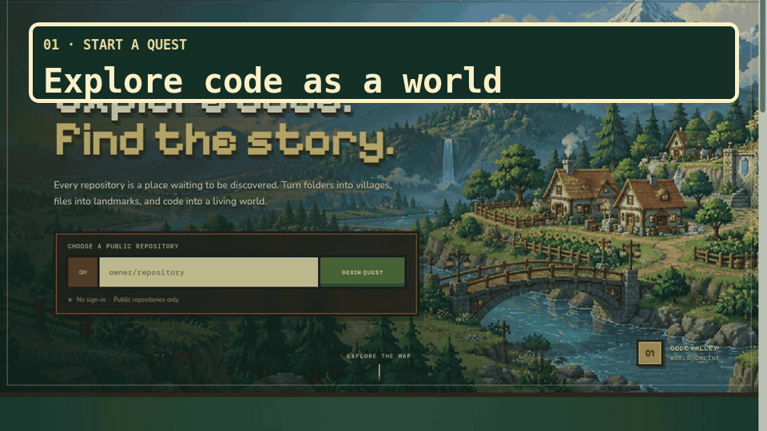
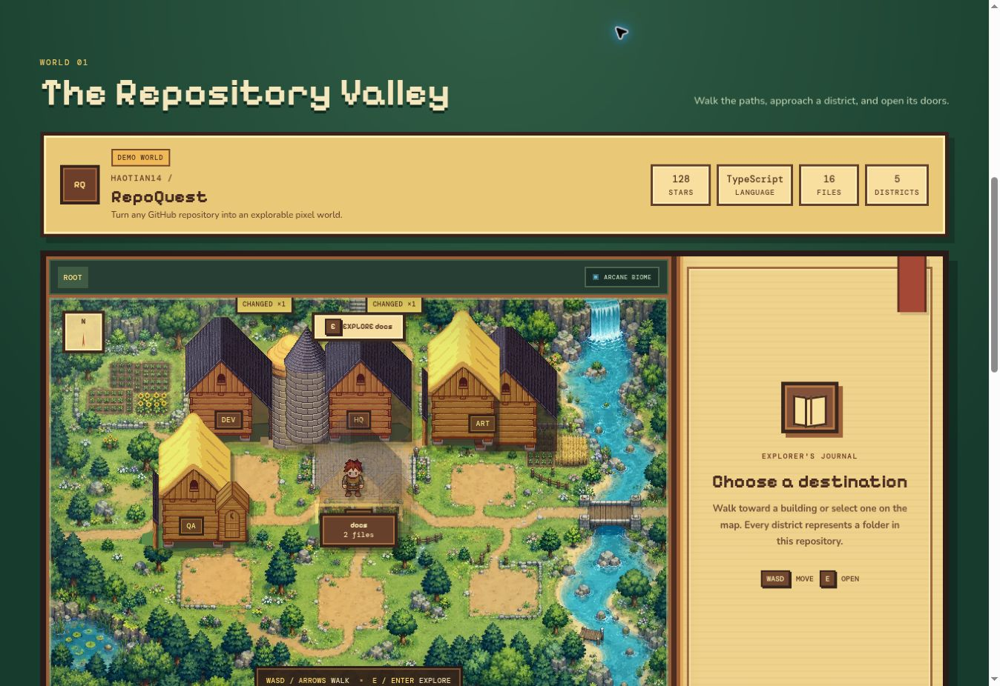
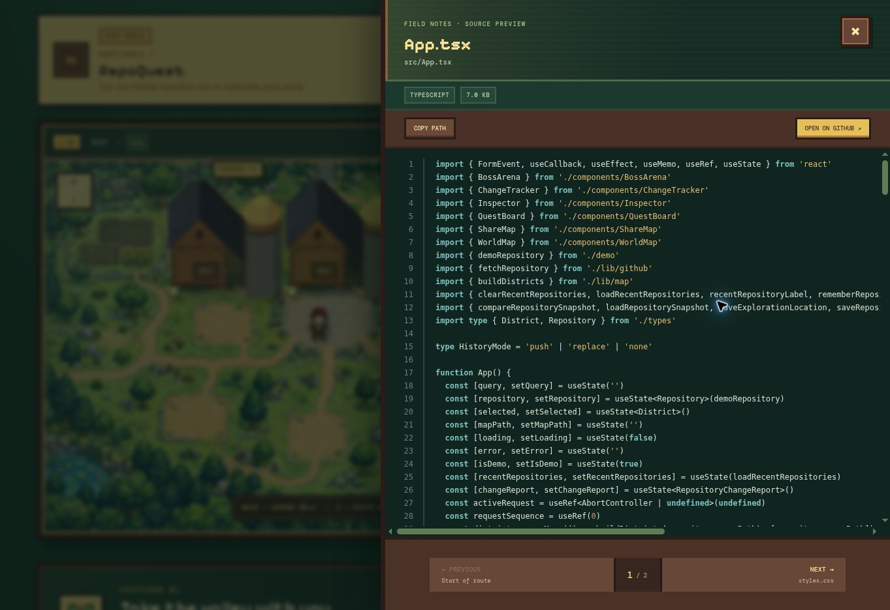
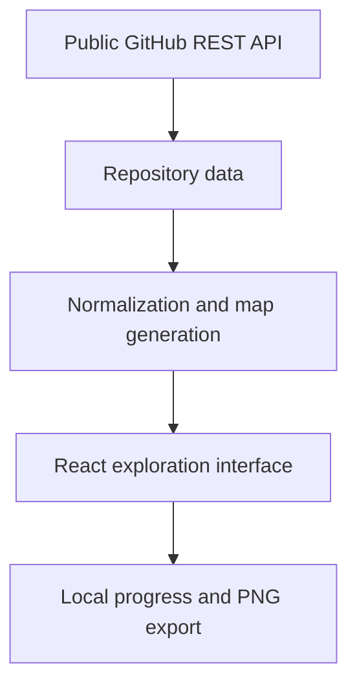

<div align="center">

# 🗺️ RepoQuest

**Turn any GitHub repository into an explorable pixel world.**

[Live demo](https://haotian14.github.io/RepoQuest/) · [How it works](#how-it-works) · [Contributing](CONTRIBUTING.md)

[](https://github.com/Haotian14/RepoQuest/actions/workflows/ci.yml)
[](https://github.com/Haotian14/RepoQuest/actions/workflows/deploy.yml)
[](LICENSE)

</div>



<p align="center"><em>Search a public repository, walk through its folders, and read source without leaving the world.</em></p>

RepoQuest transforms the structure of a public GitHub repository into a playful 2D map. Folders become districts, files become places, and the size of each district reflects the amount of code it contains. A built-in demo world is available immediately; enter `owner/repository` to explore another public project.

## Features

- Explore any public GitHub repository without signing in
- Generate a deterministic 2D pixel map from its file tree
- Walk around with WASD, arrow keys, or touch controls
- Approach buildings and press `E` to enter nested folder maps
- Follow breadcrumb trails through `src`, `components`, `lib`, and deeper districts
- Preview highlighted source in-site, copy its path, inspect changed lines, or open it on GitHub
- Turn recent commits into reviewable quests with local progress
- Face open issues and pull requests as locally tracked boss battles
- Export the repository valley as a high-resolution PNG card
- Open a local smart guide that reads selected manifests and entry files to infer stack, startup, imports, tests, and a reading route
- Compare repository snapshots across visits and continue from the last explored district
- Use a responsive interface on desktop and mobile
- Run without a backend or server-side storage; recent history and progress stay on this device

## Screenshots

| Repository map | Source preview |
| --- | --- |
|  |  |

The interface reflows for smaller screens and keeps touch controls visible while exploring the map. Open the [live demo](https://haotian14.github.io/RepoQuest/) on a phone to try the responsive layout.

## Quick start

### Requirements

- Node.js 22.13 or newer
- npm 11

```bash
git clone https://github.com/Haotian14/RepoQuest.git
cd RepoQuest
npm ci
npm run dev
```

Open `http://localhost:5173` and enter a repository as either `owner/repository` or a complete GitHub URL.

## How it works



1. RepoQuest requests public repository metadata directly from the browser.
2. The recursive Git tree is normalized into navigable folder levels.
3. Deterministic layout rules assign the largest groups to districts at the current map depth.
4. File count controls building level, while file size powers district statistics.
5. On demand, local static analysis reads up to 10 small key files to infer the stack, commands, entries, imports, tests, and reading route without uploading source code.
6. File previews and latest-commit patch hints are fetched directly from GitHub and rendered in the browser.
7. Quest progress, repository snapshots, and the last explored map location are saved only in browser `localStorage`; exported map cards are rendered in the browser.

## Engineering highlights

- **Deterministic worlds:** the same repository structure produces the same district arrangement, making maps recognizable and shareable.
- **Nested repository geography:** each folder level becomes its own world, with breadcrumbs, return navigation, and language-specific biome styling.
- **Game-like spatial interaction:** keyboard, touch, proximity actions, character direction, and depth-based building occlusion work together without a game engine.
- **Progressive public data:** the core repository tree remains useful even when optional commit or issue requests fail.
- **Privacy-conscious guidance:** smart explanations are rule-based and run locally, with no AI key, backend, or source-code upload.
- **Tested delivery:** unit and component tests run in CI before the GitHub Pages build is deployed.

## Data limits and privacy

- RepoQuest supports public repositories only and uses unauthenticated GitHub REST API requests, which are rate limited.
- It requests the latest 10 commits, up to 9 highly discussed open issues or pull requests, and up to 100 changed files from the latest commit. Optional-request failures are shown as warnings while the repository map remains usable.
- The app keeps at most the first 3,000 files returned by GitHub. GitHub may also truncate recursive trees for very large repositories, so unusually large maps can be partial.
- When opened, the smart guide downloads up to 10 small public key files directly from GitHub for in-browser static analysis. Source previews download only the selected public file. Source contents are never uploaded or persisted by RepoQuest.
- Review progress, battle progress, repository snapshots (paths and sizes), last map locations, and the names of up to five recently explored public repositories stay in the current browser's local storage. RepoQuest has no application backend or analytics service. Recent history can be cleared from the search panel.

## Scripts

| Command | Purpose |
| --- | --- |
| `npm run dev` | Start the Vite development server |
| `npm test` | Run the Vitest suite once |
| `npm run test:watch` | Run tests in watch mode |
| `npm run build` | Type-check and create a production build |
| `npm run preview` | Preview the production build locally |

## Project structure

| Path | Responsibility |
| --- | --- |
| `src/components` | World map, inspector, quest, arena, and sharing interfaces |
| `src/lib` | GitHub normalization, map rules, movement, progress, and guide heuristics |
| `src/assets` | Generated project artwork and attributed LPC game assets |
| `src/test` | Shared Vitest and Testing Library setup |
| `.github/workflows` | Continuous integration and GitHub Pages deployment |
| `docs/images` | README screenshots, demo GIF, and social preview artwork |
| `scripts` | Reproducible showcase-asset generation |

## Roadmap

- [x] Public repository exploration
- [x] Pixel districts and file inspector
- [x] Walkable character and keyboard navigation
- [x] Commit-history quests
- [x] Issue and pull-request boss battles
- [x] Shareable map screenshots
- [x] Local smart code explanations
- [x] In-app source preview and latest-change line hints
- [x] Multi-level folder maps, breadcrumbs, and language biomes
- [x] Manifest/import-aware local static analysis
- [x] Repository change snapshots and continue-exploration flow
- [ ] Optional local GitHub token support and private repository exploration
- [x] Shareable repository URLs, changed-file hotspots, and direct source navigation
- [ ] Dependency graph overlays and side-by-side repository comparison
- [ ] More biome artwork and language-specific landmarks

## Contributing

Bug reports, ideas, and pull requests are welcome. Read [CONTRIBUTING.md](CONTRIBUTING.md) for setup, validation, and pull-request guidance. Release history is recorded in [CHANGELOG.md](CHANGELOG.md).

## License and artwork

RepoQuest source code is available under the [MIT License](LICENSE). This does **not** relicense the bundled third-party artwork.

The pixel buildings and explorer use LPC artwork under CC BY 4.0 and CC BY-SA 3.0. Their authors, source links, modifications, and applicable licenses are documented in [THIRD_PARTY_ASSETS.md](THIRD_PARTY_ASSETS.md) and in the credit files beside those assets. The generated project artwork is described separately in the same document.
